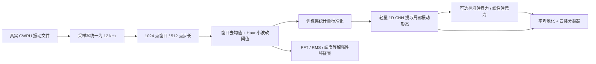

# 我现在的算法到底是什么？

项目有两条用途不同的算法链。网页默认使用真实公开轴承振动数据做**故障部位分类**；旧的电钻多传感器仿真模型保存在 `legacy_app.py`，用于演示健康指数、条件寿命和维修流程。两条链分别训练，不能交换输入或把仿真寿命解释成真实轴承寿命。

## 1. 原来的模型确实有 Transformer

原模型共有 **17,789 个可训练参数**。每次输入最近 16 个连续窗口，每个窗口包含：振动 RMS／峭度，电流 RMS／纹波，温升／温升斜率，以及转速、负载、环境温度和三个传感器质量分数。

计算顺序是：

1. 先在训练集的健康仿真数据中学习“正常情况下，这个工况应该有多大振动、电流、温升”。实际特征减去这个期望值，再按健康残差尺度缩放。它试图把负载增加造成的正常变化和故障变化区分开。
2. 三个传感器分支各用一个小型线性层将两个特征编码成 32 维。根据数据质量和工况计算融合权重。缺失通道不参与融合。
3. 在融合后的 16×32 特征中加入位置和工况信息。一个 **2 头、32 维、1 层的标准 Transformer** 建立窗口之间的联系，随后一个 **32 维、1 层的 LSTM** 汇总时间变化。
4. 三个输出头分别产生四档仿真状态、健康指数 HI 和条件剩余运行小时的 10%／50%／90% 分位数。

训练损失 = 状态分类的交叉熵 + HI 的均方误差 + 寿命分位数的 pinball 损失。HI 的监督值来自仿真生成器的 `1−wear`；寿命也由仿真生成器设定。风险值 `1−HI` 不是经过校准的失效概率。分位区间也没有真实工具数据的覆盖率保证。

**它在参数量上已经很小。** 但“参数少”“电脑上快”“MCU 上达标”“比基准减少 70% 算力”是四个不同判断。此前只有电脑 CPU 上的仿真实验，尚不能证明后三项中的 MCU 和 70% 指标。

## 2. 新的公开数据模型：从波形直接分类

输入一个 1024 点的单通道振动窗口，对应 12 kHz 下约 **85.3 毫秒**的信号。每 512 点产生一个窗口，因此相邻窗口会重叠；重叠窗口始终留在同一原始记录的数据分区中，不会分散到训练集和测试集。

CNN 的计算结构为：

| 层 | 作用 | 输出形状（单个窗口） |
|---|---|---|
| 一维卷积，核 7，步长 4，8 通道 | 找出短时振动波形模式并下采样 | 8×256 |
| 深度卷积，核 5，步长 2 + 逐点卷积 | 每通道提取局部形态，再交换通道信息 | 16×128 |
| 深度卷积，核 5，步长 2 + 逐点卷积 | 继续压缩序列、形成更高层特征 | 24×64 |
| 可选注意力 + 前馈层 | 关联 64 个位置的特征 | 64×24 |
| 平均池化 + 线性分类器 | 汇总成正常／内圈／滚动体／外圈四类得分 | 4 |

采用相同 CNN 前端比较三个候选：纯 CNN、CNN＋标准注意力、CNN＋线性注意力。按验证集准确率和实际 CPU 延迟选择默认模型；测试集用于最后评估。最终选择、实际参数和性能见《公开轴承模型实验报告》，并以模型 `manifest.json` 为准。

FFT 特征表用于检查频带、解释信号及后续特征融合研究。**当前公开数据分类器输入的是小波处理后的波形，而不是这张特征表。** 当前公开数据模型没有电流、温度、磨损程度、HI 或寿命输出头。

## 3. 线性注意力为什么能降低计算量？

标准注意力先计算每个位置与每个位置的关系：`softmax(QKᵀ/√d)V`。64 个位置会形成 64×64 的关系矩阵；位置数扩大时，矩阵大小按平方增长。

这里的线性注意力采用正值特征映射 `φ(x)=ELU(x)+1`，先汇总 `S=φ(K)ᵀV` 和 `z=Σφ(K)`，再对每个位置计算：

`输出_i = φ(Q_i) S / (φ(Q_i) z + ε)`。

这样避免显式构造所有位置之间的关系矩阵。固定头宽时，注意力核心计算量随位置数近似线性增长。它使用了不同的注意力核，**不是标准 softmax 注意力的完全等价改写**，需要重新训练并比较准确率。

CNN 下采样后只剩 64 个位置，所以总耗时还包括卷积、归一化、前馈层和小波处理。注意力核心更省，不代表整个程序一定更快，也不保证减少 70% 总算力。实验报告同时给出理论 MAC 估计和实测 CPU 耗时，以避免只看公式。

## 4. 故障部位、受损档位和剩余寿命怎么理解？

- **故障部位**：公开数据模型真正预测的结果，四类分类。页面的 softmax 得分表示模型内部相对得分，尚未校准为可靠概率。
- **人工缺陷尺寸档位**：来自 CWRU 试验文件标签，例如 0.007／0.014／0.021 英寸（约 0.178／0.356／0.533 mm）。这是试验中加工出的缺陷，不是算法测出了实际磨损深度，也不代表自然轻／中／重度磨损。
- **虚拟磨损档位**：实验台中人为选择的正常／轻度／中度／重度生成参数，便于观察三种模拟传感器的变化，不能当成预测准确率。
- **剩余寿命**：CWRU 没有完整自然退化到失效轨迹，当前不给出数字。NASA IMS 提供真实退化趋势，但“距最后一次记录的时间”只是数据集末端代理标签；只有经过独立退化试验验证的模型，才能报告可信的寿命预测。

## 5. 下一步怎样扩展为任务书中的多模态模型？

采集真实工具的同步振动、电流、温度、转速和负载，记录维修与失效事件；用训练集健康数据建立工况基线，提取振动频谱／包络、电流谐波和温度趋势；对每个通道保留质量分数和缺失掩码，再研究小型 CNN 编码＋质量融合＋线性注意力。在独立工具、不同工况和完整退化试验上验证故障分类、严重度和寿命，才能把公开轴承预验证升级为真实电动工具模型。
