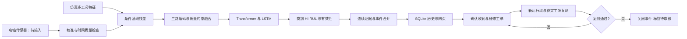
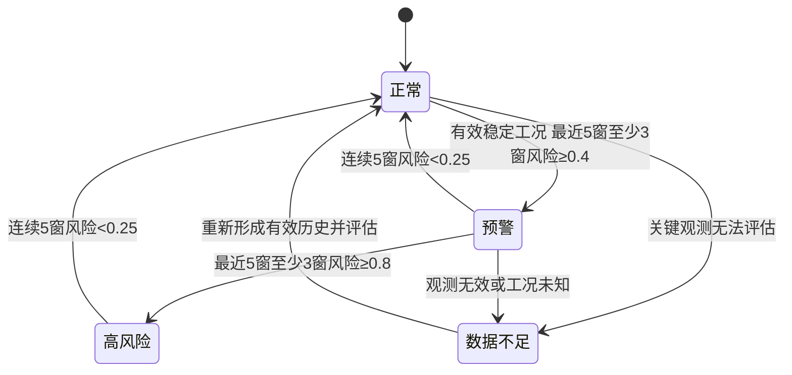
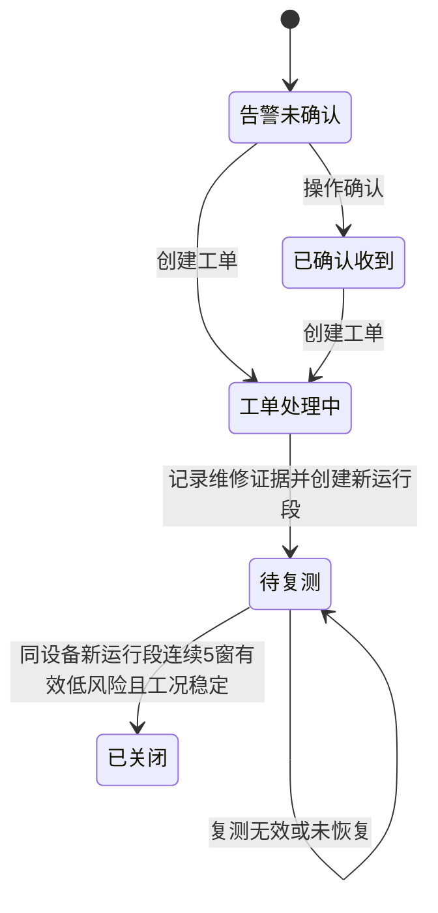

# 系统与状态流程

```mermaid
flowchart LR
 A[电钻传感器：待接入] --> B[校准与时间质量检查]
 S[仿真多工况特征] --> C[条件基线残差]
 B --> C
 C --> D[三路编码与质量约束融合]
 D --> E[Transformer 与 LSTM]
 E --> F[类别 HI RUL 与有效性]
 F --> G[连续证据与事件合并]
 G --> H[SQLite 历史与网页]
 H --> I[确认收到与维修工单]
 I --> J[新运行段与稳定工况复测]
 J --> K{复测通过?}
 K -->|是| L[关闭事件 标签待审核]
 K -->|否| I
```

```mermaid
stateDiagram-v2
 [*] --> 正常
 正常 --> 预警: 有效稳定工况 最近5窗至少3窗风险≥0.4
 预警 --> 高风险: 最近5窗至少3窗风险≥0.8
 预警 --> 正常: 连续5窗风险<0.25
 高风险 --> 正常: 连续5窗风险<0.25
 正常 --> 数据不足: 关键观测无法评估
 预警 --> 数据不足: 观测无效或工况未知
 数据不足 --> 正常: 重新形成有效历史并评估
```

上图为监测状态，不代表持久化工单状态；已创建事件不会因监测评分恢复自动关闭。

```mermaid
stateDiagram-v2
 [*] --> 告警未确认
 告警未确认 --> 已确认收到: 操作确认
 告警未确认 --> 工单处理中: 创建工单
 已确认收到 --> 工单处理中: 创建工单
 工单处理中 --> 待复测: 记录维修证据并创建新运行段
 待复测 --> 待复测: 复测无效或未恢复
 待复测 --> 已关闭: 同设备新运行段连续5窗有效低风险且工况稳定
```
